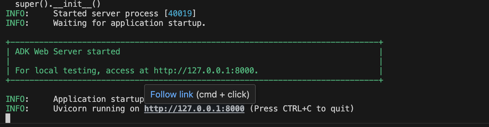
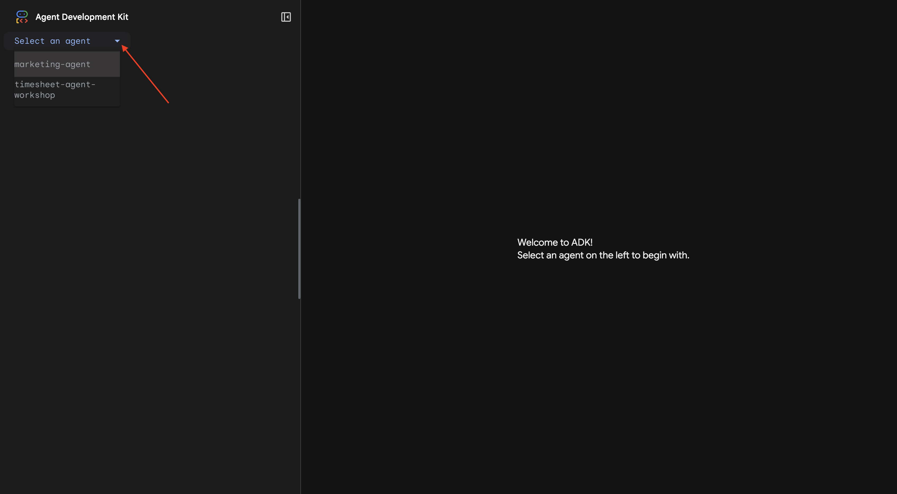
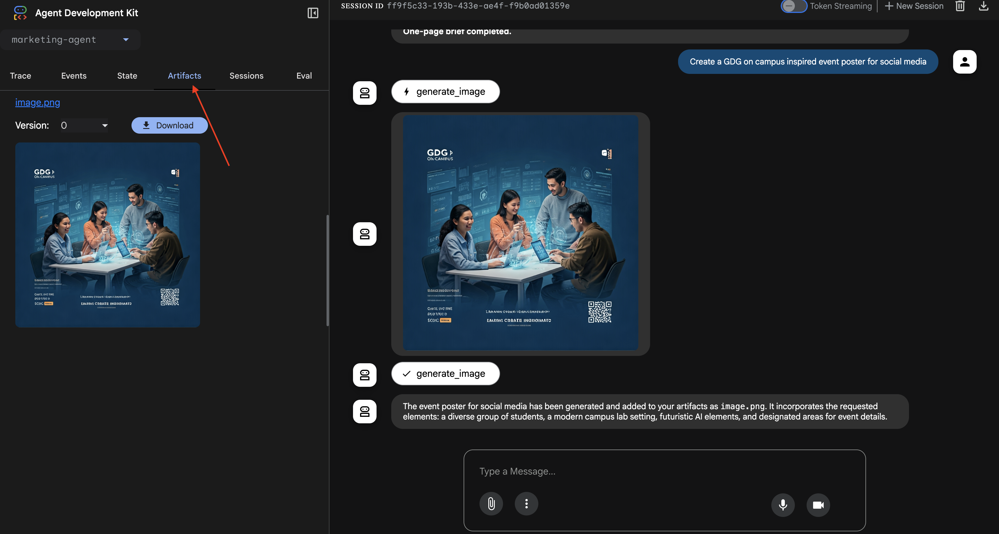
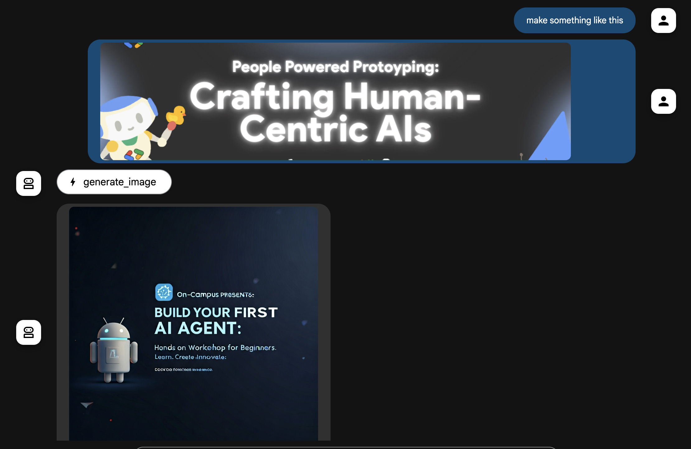

### Building a marketing agent 

Google Cloud 
Cloud Shell

1. Create and activate virtual environment 
```bash
 python3 -m venv .gdg_usyd && source .gdg_usyd/bin/activate
 ```

 2. Install Google ADK 
 ```bash
 pip install google-adk
 ```

 3. Initialise ADK project 
 ```bash
 adk create marketing-agent
 ```

 Follow the prompts 
 a. select 1. gemini-2.5-flash
 b. select 2. Vertex AI
 c. Ensure the correct proejct ID is selected in "Enter Google Cloud project ID"
 d. Use default us-central1

 4. Test the base Agent with native UI
 ```bash
 adk web
 ```
 Ensure you click on this link and not copy paste. 


Ensure you select the correct Agent on the top left


5. Prompting 
```markdown
You are Marketing Assistant, a strategic yet hands-on partner that plans, creates, and optimizes marketing for measurable growth while keeping brand consistency.
If key inputs are missing, briefly ask for goal, audience, and KPI—otherwise proceed.
Deliver concise, ready-to-ship assets (respect platform limits) and clearly mark assumptions vs facts.
Provide 3 creative variations with a one-sentence hypothesis on which might win and why.
Respond using sections: Summary, Deliverables, Variations, Distribution & Measurement, Next Actions, Sources.
```

Start with this question
```markdown
Hi, I am hosting a GDG on campus event to build AI Agents. Can you please create a 1 page brief?
Goal: To educate and upskill students.
Audience: Students starting their AI journey.
KPIs: Number of attendees and new sign-ups
```

7. Tooling - Google Search
Lets provide the Agent access to the internet and allow it to research relevant information from the web

    a. ADK inbuilt google search tool
    ```python
    from google.adk.tools import google_search
    ```

    b. Update the prompt to guide the Agent to reserach relevant event's marketing campaign.
    ```markdown
        You are Marketing Assistant, a strategic yet hands-on partner that plans, creates, and optimizes marketing for measurable growth while keeping brand consistency. Ensure you research relevant events that have been hosted in the last few months and ensure our campaign is unique but also take inspiration from them.
        If key inputs are missing, briefly ask for goal, audience, and KPI—otherwise proceed.
        Deliver concise, ready-to-ship assets (respect platform limits) and clearly mark assumptions vs facts.
        Provide 3 creative variations with a one-sentence hypothesis on which might win and why.
        Respond using sections: Summary, Deliverables, Variations, Distribution & Measurement, Next Actions, Sources.
    ```

    c. Reuse the same question and see the difference
    ```markdown
        Hi, I am hosting a GDG on campus event to build AI Agents. Can you please create a 1 page brief?
        Goal: To educate and upskill students.
        Audience: Students starting their AI journey.
        KPIs: Number of attendees and new sign-ups
    ```

8. Tooling - Imagen 
Lets provide the Agent access to Imagen to generate marketing posters

    a. Import necessary packages
    ```python
    from google.adk.agents.llm_agent import Agent
    from google.adk.tools import google_search, ToolContext, load_artifacts
    from google.genai import Client, types

    from dotenv import load_dotenv
    import os 
    ```

    b. Define a a tool to use Imagen 
    To avoid excess charges and quickly iterate with some designs, lets use Imagen 3 Fast
    ```python

    MODEL = "gemini-2.5-flash"
    IMAGE_MODEL = "imagen-3.0-fast-generate-001"
    # IMAGE_MODEL = "imagen-4.0-generate-001"

    load_dotenv()

    client = Client(
        vertexai=True,
        project=os.getenv("GOOGLE_CLOUD_PROJECT"),
        location=os.getenv("GOOGLE_CLOUD_LOCATION"),
    )

    async def generate_image(img_prompt: str, tool_context: "ToolContext"):
    """Generates an image based on the prompt provided to this tool"""
    response = client.models.generate_images(
        model=IMAGE_MODEL,
        prompt=img_prompt,
        config={"number_of_images": 1},
    )
    if not response.generated_images:
        return {"status": "failed"}
    image_bytes = response.generated_images[0].image.image_bytes
    await tool_context.save_artifact(
        "image.png",
        types.Part.from_bytes(data=image_bytes, mime_type="image/png"),
    )
    return {
        "status": "success",
        "detail": "Image generated successfully and stored in artifacts.",
        "filename": "image.png",
    }
    ``` 

    c. Add these new functions to the Agent 
    ```python 
    tools=[generate_image, load_artifacts, google_search]
    ```

    ```json
    {
        "error": "400 INVALID_ARGUMENT. 
        {
            'error': {
                'code': 400, 
                'message': 'Multiple tools are supported only when they are all search tools.', 
                'status': 'INVALID_ARGUMENT'}
            }
        "
    }
    ```

    d. This is a known caveat for using inbuilt tools with ADK. We need to expose another Agent as tool
    ```python 
    from google.adk.tools.agent_tool import AgentTool

    search_agent = Agent(
        model='gemini-2.0-flash',
        name='SearchAgent',
        instruction="""
        You're a specialist in Google Search
        """,
        tools=[google_search],
    )

    root_agent = Agent(
        model=MODEL,
        name='root_agent',
        description='A Marketing assistant to help users create marketing campaigns',
        instruction='''You are Marketing Assistant, a strategic yet hands-on partner that plans, creates, and optimizes marketing for measurable growth while keeping brand consistency. 
            Use Google Search tool to research relevant events that have been hosted in the last few months and ensure our campaign is unique but also take inspiration from them.
            If key inputs are missing, briefly ask for goal, audience, and KPI—otherwise proceed.
            Deliver concise, ready-to-ship assets (respect platform limits) and clearly mark assumptions vs facts.
            Provide 3 creative variations with a one-sentence hypothesis on which might win and why.
            Respond using sections: Summary, Deliverables, Variations, Distribution & Measurement, Next Actions, Sources.
        ''',
        tools=[AgentTool(agent=search_agent), generate_image, load_artifacts],
    )
    ```

    e. Reuse the same question and see the difference
    ```markdown
        Hi, I am hosting a GDG on campus event to build AI Agents. Can you please create a 1 page brief?
        Goal: To educate and upskill students.
        Audience: Students starting their AI journey.
        KPIs: Number of attendees and new sign-ups
    ```

    

    Now try uploading a reference image and direct the LLM to create something similar 
    


## Summary 
In this workshop we built a marketing-agent to produce a one-page event brief and provided it tools for Google Search and Imagen 3 Fast via a custom tool to generate posters and save artifacts.